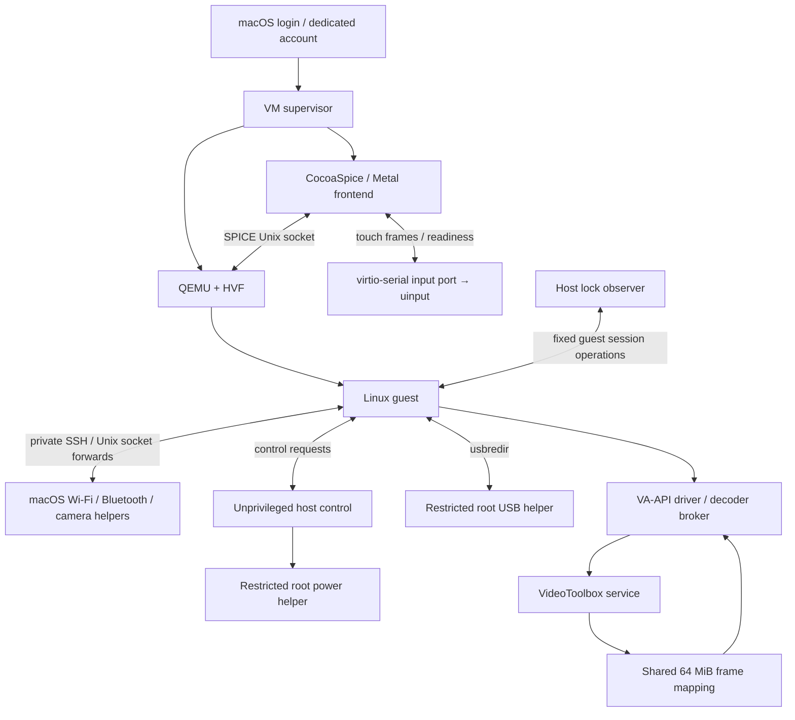

# Architecture

Ashacky provides a Linux desktop on a dedicated macOS account. macOS retains ownership of hardware whose physical drivers cannot be passed through to QEMU. Linux receives standard virtual devices where practical and management facades where the host must retain ownership.

## Current runtime

The supervisor owns QMP and one private VM disk. It connects the network backends, starts host control/video helpers and QEMU, connects the frontend, then continues the guest. It checks for another process using the disk before launch. Frontend and codec retries are bounded. An intentional guest shutdown does not start a new VM.

SPICE handles display, cursor, keyboard, audio, clipboard and guest display changes. The frontend creates a borderless display window directly rather than entering a native fullscreen Space after a windowed launch. Its escape shortcut is Control–Option–Shift–F12; a keyboard may require Fn for F12. The source supports two guest outputs; more have not been validated.

## Devices

| Feature | Linux interface | Host path / limitation |
| --- | --- | --- |
| Wi-Fi | cfg80211 module, NetworkManager | CoreWLAN scans/connection management; packets use a dedicated bridged virtio NIC. Management networking uses a second, shared NIC. No monitor mode. |
| Bluetooth | BlueZ-compatible D-Bus service and rfkill | Host pairs/connects devices. Host handles HID and audio traffic. General guest Bluetooth protocol traffic is not implemented. |
| Audio | SPICE HDA and PipeWire sinks/sources | Selecting a Linux endpoint changes the host default device. Multiple names share one SPICE transport; they are not independent per-application physical routes. |
| Webcam | v4l2loopback | Host camera capture runs on guest demand. Depends on macOS camera authorization. |
| Trackpad | Type-B multitouch uinput device | NSTouch frames travel through a SPICE port. Readiness and timeout behavior preserve normal pointer fallback. |
| USB | USB redirection | Active-account storage-only autoattach. Four explicit root ports are essential to the validated hotplug fix. Host input/radio devices are excluded. |
| Battery | Linux power_supply → UPower | Host telemetry feeds a small virtual battery driver; stale data expires. |
| Touch ID | PAM authentication | macOS LocalAuthentication performs authentication. Enrollment stays on macOS. Linux password fallback remains available. |
| Graphics | virtio GPU, VirGL/Venus | Host ANGLE/Metal and Vulkan/MoltenVK stack. Stock guest Mesa; no custom Firefox build. |
| Video | General VA-API driver | VP9 through VideoToolbox/shared memory; H.264 through the pinned remote FFmpeg decoder. Codec and performance limits are in STATUS.md. |

Linux modules expose virtual interfaces; they are not Asahi physical-device drivers. Brightness and keyboard backlight remain host-key functions. macOS permission bundles currently retain their earlier Workbench identifiers; normal runtime uses their service modes without diagnostic windows.

## Session and privilege boundaries

Host device services, frontend, session supervisor, Touch ID and lock observation run as the dedicated user. Only the network, USB and narrowly scoped power operations require root installation. Those executables and their loaded dependencies must reside in administrator-controlled locations; never point a root LaunchDaemon at mutable checkout scripts.

Power control authenticates the actual socket peer's UID and executable path and requires the active console account. It permits fixed operations, checks other sessions and rate-limits actions. A clean QMP guest shutdown completes an armed host power/restart/logout action. Lock synchronization observes actual macOS authentication transitions; sleep or service startup alone never authorizes guest unlock. Reverse guest-lock events suppress host-origin echoes.

The guest root agent authenticates local peer credentials and the configured desktop UID. Host-control requests use a fresh per-installation secret. The current guest-management SSH connection pins a dedicated host key and verifies the expected VM UUID before use. Replacing this SSH transport with a versioned virtio-serial control protocol is future work, not a claim about this import.

The video service still accepts codec traffic on the private VM network without per-connection authentication. Shared-memory mappings are private to the VM and read-only in the guest, but network binding alone is not sufficient isolation between two test accounts/VMs. Adding an authenticated transport or isolated per-install network is a fresh-install requirement before enabling video in a second account. Do not expose these listeners to the LAN.

## Video memory ownership

VP9 compressed packets and frame descriptors traverse the broker connection. Decoded frames occupy four host-owned 16 MiB slots in a shared 64 MiB mapping exposed by the `linuxhost-shmem` PCI device. The VA driver validates frame identity and bounds, then copies each frame into stable per-surface storage so applications can retain older surfaces safely. GPU upload remains a separate step. This is not zero-copy rendering. The queued-driver experiment is intentionally absent.

The package supplies the general VA-API driver and decoder service. It does not include browser launchers, preloaded browser helpers, preferences or desktop overrides. Sandboxed applications may block the driver's Unix-socket connection or shared-memory mapping; their hardware decoding is not guaranteed by installing the driver. Firefox's earlier pre-sandbox workaround remains outside the package.

## Dedicated macOS shell

On the tested macOS release, the account-local `TALBlockSavingAndLaunch` loginwindow preference avoids the old persistent-app restoration delay. Per-user launchd overrides suppress `com.apple.Finder` and `com.apple.Dock.agent`. No system app is removed or impersonated. This relies on undocumented OS behavior, was tested with SIP disabled, and requires a fresh-login acceptance test on every newly supported macOS version. A short desktop-ready spinner with Dock disabled was accepted in the prototype.

## State and installation

One checkout contains source and one current `build/` tree. Private state contains the VM, generated identity, config, credentials, sockets/logs and an installation receipt. QEMU exposes SPICE/QGA channels; it does not inject guest software. Fresh guest integration must be bootstrapped through cloud-init, an installer hook or an explicit guest-tools installation.

The installer must discover account IDs, network interfaces, paths and device identities. Debian/GNOME is the known implementation. Distribution-specific package, PAM, initramfs, NetworkManager and desktop changes belong in adapters, with unsupported combinations reported explicitly.
