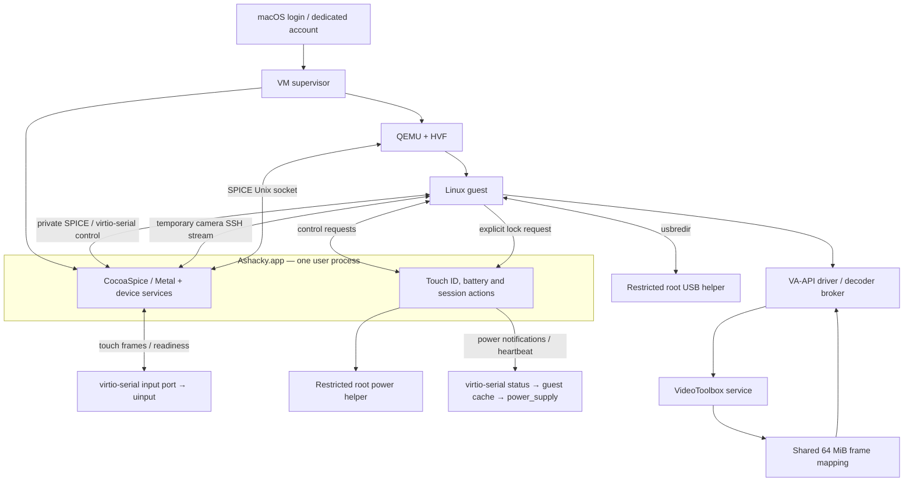

# Architecture

Ashacky provides a Linux desktop on a dedicated macOS account. macOS retains ownership of hardware whose physical drivers cannot be passed through to QEMU. Linux receives standard virtual devices where practical and management facades where the host must retain ownership.

## Current runtime

The supervisor owns QMP and one private VM disk. A bundled background launcher uses macOS LaunchServices to give Ashacky.app its own permission attribution; it reports clean exits versus crashes and terminates the app when its supervisor stops. The launcher observes `NSRunningApplication.isTerminated` with KVO, including its initial value to catch an exit before registration. It has no periodic exit timer. On the first stop signal it requests termination and schedules one forced-termination attempt after the remaining three-second grace period; repeated signals cannot extend it, and normal exit cancels the pending work. A clean receipt or supervisor-requested stop reports success; an unexpected exit without a receipt reports failure. The supervisor connects the network backends, starts the video helpers and paused QEMU, then launches Ashacky. It waits for the app's authenticated control endpoint before continuing the guest. It checks for another process using the disk before launch. The temporary camera SSH forward and both decoder servers belong to this session, with bounded child restarts and cleanup at exit. Host control is linked into the main app and shares its run loop, identity and lifetime. Lock requests go directly to macOS; there are no host-to-guest lock/unlock commands. An intentional guest shutdown does not start a new VM.

SPICE handles display, cursor, keyboard, audio, clipboard and guest display changes. The frontend creates a borderless display window directly rather than entering a native fullscreen Space after a windowed launch. Its escape shortcut is Control–Option–Shift–F12; a keyboard may require Fn for F12. The source supports two guest outputs; more have not been validated.

## Devices

| Feature | Linux interface | Host path / limitation |
| --- | --- | --- |
| Wi-Fi | cfg80211 module, NetworkManager | CoreWLAN scans/connection management; packets use a dedicated bridged virtio NIC. Management networking uses a second, shared NIC. No monitor mode. |
| Bluetooth | BlueZ-compatible D-Bus service and rfkill | Host pairs/connects devices. Host handles HID and audio traffic. General guest Bluetooth protocol traffic is not implemented. |
| Audio | SPICE HDA and PipeWire sinks/sources | CoreAudio notifications invalidate the host device list; PipeWire events report Linux selection/volume changes. Multiple names share one SPICE transport; they are not independent per-application physical routes. |
| Webcam | v4l2loopback | Host camera capture runs on guest demand. Depends on macOS camera authorization. |
| Trackpad | Type-B multitouch uinput device | NSTouch frames travel through a SPICE port. Readiness and timeout behavior preserve normal pointer fallback. |
| USB | USB redirection | Active-account storage-only autoattach. Four explicit root ports are essential to the validated hotplug fix. Host input/radio devices are excluded. |
| Battery | Linux power_supply → UPower | Native macOS power notifications push telemetry through virtio-serial; inotify updates the virtual battery. A heartbeat maintains freshness; stale data expires. |
| Touch ID | PAM authentication | macOS LocalAuthentication performs authentication. Enrollment stays on macOS. Linux password fallback remains available. |
| Graphics | virtio GPU, VirGL/Venus | Host ANGLE/Metal and Vulkan/MoltenVK stack. Stock guest Mesa; no custom Firefox build. |
| Video | General VA-API driver | VP9 through VideoToolbox/shared memory; H.264 through the pinned remote FFmpeg decoder. Codec and performance limits are in STATUS.md. |

Linux modules expose virtual interfaces; they are not Asahi physical-device drivers. Brightness and keyboard backlight remain host-key functions. The CocoaSpice frontend and Wi-Fi, Bluetooth/audio and camera services are linked into one executable in Ashacky.app, with bundle identifier `local.ashacky.host`. The application owns Location, Bluetooth, Camera and Microphone permissions. There is no custom permission window. The application requests undecided permissions through the native macOS prompts, one at a time; granted or denied access is not re-prompted. An explicit `--setup PRIVATE_DIRECTORY` mode can request these permissions before the first VM boot. A normal app open starts the installed session job. The root guest control sockets live in `/run/ashacky-control`; host device sockets retain their compatibility names.

## Session and privilege boundaries

Power-source changes use `IOPSNotificationCreateRunLoopSource`. The frontend sends newline-delimited JSON snapshots (`version: 1`, `status: {...}`) over `org.ashacky.status`, a read-only SPICE/virtio-serial channel. Sleep/wake and session activity also trigger snapshots; a ten-second heartbeat refreshes the existing battery watchdog. The guest agent validates messages, atomically replaces its status cache, and the battery feeder watches that directory with inotify before writing the existing sysfs interface. The kernel emits `power_supply_changed()` for UPower. No new guest kernel ABI or desktop extension is needed.

The event channel carries no credentials and accepts no power or authentication commands. Older QEMU configurations, missing channels and expired heartbeats fall back to the authenticated five-second status RPC. This fallback can still delay charger updates. Audio and Bluetooth management use the same event channel as described below.

Host device services, frontend, session supervisor, Touch ID and screen-lock requests run as the dedicated user. Only the network, USB and narrowly scoped power operations require root installation. Those executables and their loaded dependencies must reside in administrator-controlled locations; never point a root LaunchDaemon at mutable checkout scripts.

Power control authenticates the actual socket peer's UID and executable path and requires the active console account. It permits fixed operations, checks other sessions and rate-limits actions. A clean QMP guest shutdown completes an armed host power/restart/logout action. macOS owns screen locking and authentication. The GNOME extension routes the normal screen-shield lock entry point to `hostctl lock`, covering the menu, Super+L and the ScreenSaver D-Bus request. Debian does not open its own lock screen first. Disabling the extension restores its original method. A host request failure reports an error in GNOME; it does not silently claim the screen is locked.

The guest root agent authenticates local peer credentials and the configured desktop UID. Device and session control use the private channel described below. Camera alone still uses the pinned SSH key and expected VM UUID; replacing that bulk stream with shared memory is deferred. Administrative SSH remains separate from application transport.

The video service still accepts codec traffic on the private VM network without per-connection authentication. Shared-memory mappings are private to the VM and read-only in the guest, but network binding alone is not sufficient isolation between two test accounts/VMs. Adding an authenticated transport or isolated per-install network is a fresh-install requirement before enabling video in a second account. Do not expose these listeners to the LAN.

## Private control channel

`org.ashacky.control` is a bidirectional SPICE port attached to the existing virtio-serial controller. It carries Wi-Fi, Bluetooth/audio, power, Touch ID and explicit guest-to-host lock requests. Camera pixels, audio samples, decoded video and public status snapshots do not pass through it. There is no network address discovery or SSH connection for control, so changing the host Wi-Fi connection cannot interrupt this path.

`ashacky-control.service` owns the root-only guest port and mode-0600 Unix sockets `host.sock`, `wifi.sock` and `bluetooth.sock` inside `/run/ashacky-control` (0700). Existing root helpers use their existing JSON operations there; desktop users still go through the peer-UID-checked agent and device facade. The udev rule keeps the port root-owned at 0600. The app dispatches to its existing private listeners, retaining active-console checks, field validation, LocalAuthentication and its single permission identity. No guest request may reach the supervisor-only `vm-stopped` operation.

Protocol version 1 uses newline-delimited JSON, a fresh guest nonce and host session UUID, and the existing per-installation token on the private port handshake. Host-control RPC also retains its existing token check. Every later message is bound to that connection's session UUID; request IDs are increasing and replies are correlated independently. Frames are limited to 32 KiB, each output queue to 256 KiB, local guest clients to 32 and host service workers to 16, including workers surviving a disconnect. SPICE writes retain their data until completion, run one at a time and can be cancelled. A stalled write or handshake expires after ten seconds. Local requests expire after 20 seconds for devices or 80 seconds for host authentication; request parsing and response delivery each have a five-second limit. Idle control traffic needs no heartbeat or polling loop.

A channel failure closes pending local calls and starts a fresh handshake through systemd recovery. The transport never retries a lock, power or authentication request automatically. It accepts no unsolicited guest-execution or unlock command from the host. An operation already executed cannot be undone by losing its reply. Reconnecting does not change authentication or desktop state. The old guest lock watcher, host lock/unlock observer and half-second snapshot poll have been removed.

The GNOME lock adapter coalesces repeated lock activations while one request is outstanding. Failure permits a later explicit retry; disabling the extension cancels an undispatched request and restores the previous method without replacing another extension's later override. `disable-lock-screen` must remain false so GNOME exposes its Lock action, and the normal `screensaver` binding includes `'<Super>l'`. The adapter changes the action's destination rather than disabling its UI. macOS must require authentication after locking/sleep; Debian's automatic idle policy is configured independently. Other desktops can bind their Lock action to `hostctl lock`; only GNOME 50 is validated here.

See [the coordinated migration procedure](DEVELOPMENT.md#updating-the-private-control-channel). Older apps and guest socket paths require that coordinated update; there is deliberately no SSH fallback for these control operations.

## Audio management events

CoreAudio listeners watch the host device list, default input/output, device names, stream capabilities and output master volume/mute. They coalesce notification bursts for 50 ms and publish an opaque `audioRevision` through the existing status channel. The token includes an app-lifetime identity, so restarting Ashacky invalidates the guest cache. Device UIDs/names and selection requests stay in the existing authorized management RPC; they are not added to the public status cache. Audio sample transport remains SPICE.

The guest keeps one `pw-dump --monitor --no-colors` process. It handles node changes in memory and queries the default-metadata object only on a metadata event, including key deletion. Temporary client activity and irrelevant node state changes do not cause device queries. GIO watches the host status cache; an audio revision, host session transition or wake triggers a device-list refresh. Loopback child exits trigger recovery. Self-generated default changes are tracked so delayed events cannot be mistaken for a new user choice; mute and zero-volume settings remain under the user's control.

An older frontend with no audio revision, or a stale status stream, retains one-second host-device polling as a compatibility path. PipeWire graph polling is not reintroduced. A failed PipeWire monitor ends the audio client for systemd to restart; transient host errors use a bounded retry interval. These are recovery paths, not ordinary idle refreshes.

The selected output exposes `outputVolume` only when CoreAudio can read and write both master level and mute. The guest mirrors the host scalar into the native PipeWire/Pulse cubic volume scale. A single Props update writes the displayed `channelVolumes` and separate `softVolumes`: the master software gain stays at unity, with any Linux channel balance retained. Per-application gain stays local. Muting remains effective on both sides. This avoids applying the master attenuation twice; it does not synchronize microphone gain or mute.

Linux slider/mute changes use the bounded `audio-volume` RPC with the output UID, desired state and expected previous host state. The host requires the active console account, validates finite 0..1 levels and booleans, checks the current default output and compares a fresh volume read before writing. Hardware readback, including quantization or a conflicting keyboard change, is authoritative. This is conflict detection, not an atomic CoreAudio transaction. Own PipeWire updates are tracked to suppress feedback; a missing acknowledgement retries the display update instead of writing an old level back to macOS.

Older hosts and outputs without both writable controls retain software volume. A management failure keeps existing public nodes and restores local software attenuation/mute, rather than removing a muted sink and allowing fallback to the raw HDA transport. Successful reconnection adopts the host's current master state. During a guest slider change, PipeWire may briefly apply its software gain before the host reply restores unity; failed control can leave extra attenuation until recovery. No new idle volume polling, application, permission prompt or desktop extension is introduced.

## Bluetooth management events

The host uses IOBluetooth's [global connection notification](https://developer.apple.com/documentation/iobluetooth/iobluetoothdevice/register%28forconnectnotifications%3Aselector%3A%29), per-device disconnection registrations, device name/service notifications and the existing CoreBluetooth power-state callback. Ashacky's scan and pairing callbacks also invalidate the cache. Notifications coalesce for 50 ms into an opaque `bluetoothRevision`, with an app-lifetime identity; addresses, names, SDP records and pairing codes remain in the authorized management RPC. Registration failure omits the revision so the guest retains its compatibility path. The app unregisters listeners on shutdown.

The guest's existing BlueZ facade watches atomic status-cache updates with GIO, refreshes on revisions/session transitions/wake, and emits ordinary ObjectManager/property signals for GNOME. Events arriving during a snapshot schedule another read instead of being lost. Unchanged heartbeats feed the virtual radio's existing 15-second watchdog from the last validated snapshot, without fetching devices; changed revisions require a fresh snapshot first. No HCI, HID or audio payload is injected into Linux.

A 60-second reconciliation remains for missed notifications and external changes that may not emit these callbacks, such as forgetting a paired device in macOS. Missing or stale revision capability uses the previous two-second refresh. Transient RPC failures retry after two seconds; an inactive host waits for activation. Discovery repeats only while a D-Bus client requests it. The existing scan RPC waits for the bounded inquiry to finish and serializes device-management requests, so device-list updates during an active scan can still wait a few seconds. Outstanding pair/connect/disconnect commands retain their bounded half-second operation-status checks and the host's existing completion delay; this change removes the frequent idle device-list poll, not those command waits. The Bluetooth radio module ABI is unchanged. Turning the host Bluetooth radio on/off from Linux remains unsupported; changes made in macOS are reflected in Linux.

## Wi-Fi kernel request notifications

The cfg80211 module wakes the root bridge when Linux requests a scan, connection or disconnection. The bridge waits with `poll()` on `/dev/linuxhost-wifi`, after querying `LH_GET_CAPABILITIES` (`_IOR('L', 7, __u32)`, native-endian bit 0 = request readiness). An older module that returns `ENOTTY`, or omits that bit, retains the previous 100 ms compatibility loop. No host protocol, QEMU device or desktop integration changes are required.

Readiness means an unread pending request on that open file descriptor. Successful `GET_SCAN` and `GET_CONNECTION` calls advance its separate observation cursors; they do not complete or consume the shared request. A reopened bridge therefore sees pending work again. Registering the wait before checking state under the wiphy mutex avoids losing a request that arrives between the ioctl and sleep. An observed request does not keep `poll()` spinning while it is completed or expires. Root-only access, sequence validation, credential handling and the independent 45-second scan/90-second connection timeouts are unchanged.

This removes the bridge's idle request checks. Signal strength still refreshes every five seconds; that deadline can wake the request wait. Radio synchronization uses the separate event path below. Host scan/connect operations remain synchronous and bounded, so a request queued during host I/O waits for that operation to finish. The channel does not accelerate the host's actual scan or association work.

## Wi-Fi radio events

CoreWLAN power and connection callbacks invalidate an opaque `wifiRevision` in the existing status stream. Location authorization and Ashacky's own Wi-Fi mutations also invalidate it. The token contains an app-lifetime identity and a generation, coalesced for 50 ms. Network identities remain in the authorized Wi-Fi RPC. Registration failure or a lost client connection removes the capability; CoreWLAN automatically rearms interrupted registrations, and a subsequent callback restores the token. Permanent invalidation needs an app restart to register again.

The guest radio service reads the kernel's `/dev/rfkill` event stream and watches the atomic host status cache with GIO. Startup synchronizes from the actual host; an initial rfkill value is not a request to change macOS. Host-origin writes are recognized as echoes. A single worker handles bounded RPCs without blocking the event loop, so a newer guest choice survives a delayed older reply. An uncertain power mutation is not retried blindly: the client reads back actual state and preserves any newer request. Inactive sessions cannot submit new mutations, and unchanged status heartbeats cause no radio query.

Missing/stale `wifiRevision` retains a one-second host-status compatibility refresh; Linux radio changes still arrive as events. Failed reads use bounded retries, and a broken rfkill stream exits for systemd recovery. The guest kernel ABI and the existing five-second signal refresh are unchanged. RSSI callback reliability remains a separate acceptance check before removing that refresh.

Apple's [event-registration documentation](https://developer.apple.com/documentation/corewlan/cwwificlient/startmonitoringevent%28with%3A%29) specifies `com.apple.wifi.events`. It is a restricted entitlement: adding it to the reference ad-hoc signed probe caused AMFI to reject the executable. The reference macOS instead delivered power/connection notifications with the existing signing style and no added entitlement. Do not add the restricted entitlement to Ashacky's ad-hoc signature; test runtime event delivery on each intended macOS release and retain the capability fallback where unavailable.

## Wi-Fi access-point selection and roaming

macOS owns access-point selection. The guest wiphy advertises `WIPHY_FLAG_SUPPORTS_FW_ROAM`, which lets stock wpa_supplicant use an AP hint for automatic connections. An explicitly pinned BSSID remains a strict constraint. The bridge verifies the actual host SSID/BSSID and a matching scan record before completing association; macOS may choose another compatible AP on the requested network. A pin that macOS does not honor fails rather than being silently ignored.

Kernel capability bit 1 (`LH_CAP_HOST_LINK`) advertises the link-report ABI. `LH_GET_LINK` (`_IOR('L', 8, ...)`, 46-byte packed structure) returns a connection generation, flags, SSID and associated BSSID, with no key. `LH_REPORT_LINK` (`_IOW('L', 9, ...)`) takes a 58-byte header followed by at most 4096 bytes of real beacon/probe IEs. Report state 2 supplies the initial BSS, state 1 reports a host roam and state 0 reports loss. The root-only channel validates generation, pending operation, SSID, pin, address, channel, IE bounds and supported security. A new kernel request invalidates older reports. Roams publish `cfg80211_roamed()` with a retained BSS reference; a duplicate AP report is harmless.

The connection contract is open Wi-Fi or WPA2-PSK with CCMP. Enterprise authentication, SAE and required PMF are unsupported. Candidate and actual AP records must satisfy that contract; a same-SSID open AP cannot satisfy a WPA2 request. On a host move to another network or away from an explicit pin, Linux loses its connection instead of reporting an unauthorized roam.

The guest bridge watches atomic status replacements with inotify and wakes its existing kernel `poll()` when `wifiRevision` changes. Heartbeats do not trigger extra host reads. Roam verification uses fresh scan information and a second identity read after the scan, since scanning can take seconds. A missing identity must persist across a one-second confirmation deadline before link loss is reported; unavailable Location authorization is not treated as a disconnect. The existing five-second signal refresh also provides link reconciliation for old/stale frontends and missed events. Signal notifications remain a separate refinement.

## Trackpad input waits

The guest waits on the existing `org.linuxhost.input` virtio-serial port until touch data arrives or a real deadline expires. It sends `LH_INPUT_READY` once per second and releases held contacts/buttons after one second without a valid frame. These deadlines are independent: unrelated partial input cannot postpone release. There is no fixed 100 ms idle check. A blocked readiness reply waits for descriptor writability while continuing to accept input and enforce the held-contact deadline. EOF/errors release state and close the port; the existing one-second reconnect delay remains.

`LH_INPUT_APPLIED` is sent only after a nonempty, validated contact frame reaches uinput. Device identity, coordinates, slot/button handling and the host's pointer-ownership gates are unchanged. The frontend retains its three-second readiness expiry, half-second applied-frame expiry, 250 ms touch-state heartbeat and focus/cancellation handling. The host can therefore still send empty frames periodically, and the guest must still wake for readiness; this refinement does not promise zero idle wakeups. Host heartbeat/focus changes require separate review and attended fallback testing.

## Camera demand events

The camera service keeps the V4L2 device discoverable with a persistent FFmpeg writer primed with generated black frames. The usage helper subscribes to v4l2loopback's private client-usage event, requesting an initial snapshot, and blocks in `poll()` until an event or channel failure. This contract was verified against v4l2loopback 0.15.4; the reported value is a reader-active boolean, not a reader count. An incompatible module must fail visibly instead of opening the host camera without reliable demand tracking.

The guest's idle Python loop waits on an event signaled by demand changes, termination or child exit. The usage pipe has a blocking reader and the writer has a blocking process waiter. Loss of the monitor clears demand and fails the service for systemd recovery; writer failure also wakes the service. When the final reader stops, the host socket closes and generated black frames replace the last camera image. The change removes the service's 100 ms idle check and the usage helper's periodic 15-second wakeup. FFmpeg's internal worker behavior is unchanged.

Active capture retains its five-second startup timeout, one-second streaming cancellation bound, half-second retry/lease-renewal delay and the host's 30-second stream lease. Child cleanup has bounded terminate/kill waits. These are operation/recovery limits; the service does not open the camera periodically while idle. A finite usage-helper diagnostic still has a 15-second event timeout.

## Video memory ownership

VP9 compressed packets and frame descriptors traverse the broker connection. Decoded frames occupy four host-owned 16 MiB slots in a shared 64 MiB mapping exposed by the `linuxhost-shmem` PCI device. The VA driver validates frame identity and bounds, then copies each frame into stable per-surface storage so applications can retain older surfaces safely. GPU upload remains a separate step. This is not zero-copy rendering. The queued-driver experiment is intentionally absent.

The package supplies the general VA-API driver and decoder service. It does not include browser launchers, preloaded browser helpers, preferences or desktop overrides. Sandboxed applications may block the driver's Unix-socket connection or shared-memory mapping; their hardware decoding is not guaranteed by installing the driver. Firefox's earlier pre-sandbox workaround remains outside the package.

## Dedicated macOS shell

On the tested macOS release, the account-local `TALBlockSavingAndLaunch` loginwindow preference avoids the old persistent-app restoration delay. Per-user launchd overrides suppress `com.apple.Finder` and `com.apple.Dock.agent`. No system app is removed or impersonated. This relies on undocumented OS behavior, was tested with SIP disabled, and requires a fresh-login acceptance test on every newly supported macOS version. A short desktop-ready spinner with Dock disabled was accepted in the prototype.

## State and installation

One checkout contains source and one current `build/` tree. Private state contains the VM, generated identity, config, credentials, sockets/logs and an installation receipt. QEMU exposes SPICE/QGA channels; it does not inject guest software. Fresh guest integration must be bootstrapped through cloud-init, an installer hook or an explicit guest-tools installation.

The installer must discover account IDs, network interfaces, paths and device identities. Debian/GNOME is the known implementation. Distribution-specific package, PAM, initramfs, NetworkManager and desktop changes belong in adapters, with unsupported combinations reported explicitly.
