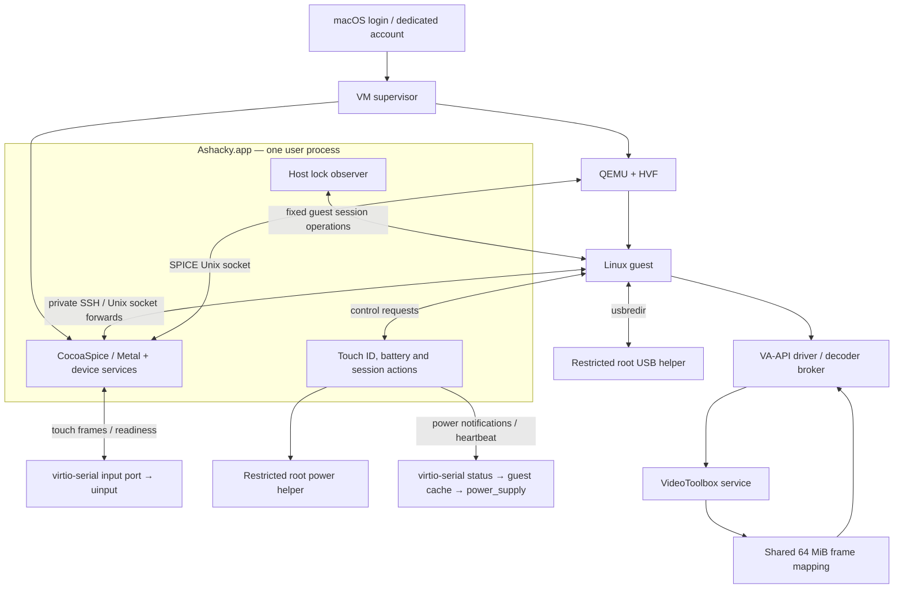

# Architecture

Ashacky provides a Linux desktop on a dedicated macOS account. macOS retains ownership of hardware whose physical drivers cannot be passed through to QEMU. Linux receives standard virtual devices where practical and management facades where the host must retain ownership.

## Current runtime

The supervisor owns QMP and one private VM disk. A bundled background launcher uses macOS LaunchServices to give Ashacky.app its own permission attribution; it reports clean exits versus crashes and terminates the app when its supervisor stops. The supervisor connects the network backends, starts the video helpers and paused QEMU, then launches Ashacky. It waits for the app's authenticated control endpoint before continuing the guest. It checks for another process using the disk before launch. SSH forwards and both decoder servers belong to this session, with bounded child restarts and cleanup at exit. Host control and SessionSync are linked into the main app and share its run loop, identity and lifetime. Their guest commands are terminated when the app stops. An intentional guest shutdown does not start a new VM.

SPICE handles display, cursor, keyboard, audio, clipboard and guest display changes. The frontend creates a borderless display window directly rather than entering a native fullscreen Space after a windowed launch. Its escape shortcut is Control–Option–Shift–F12; a keyboard may require Fn for F12. The source supports two guest outputs; more have not been validated.

## Devices

| Feature | Linux interface | Host path / limitation |
| --- | --- | --- |
| Wi-Fi | cfg80211 module, NetworkManager | CoreWLAN scans/connection management; packets use a dedicated bridged virtio NIC. Management networking uses a second, shared NIC. No monitor mode. |
| Bluetooth | BlueZ-compatible D-Bus service and rfkill | Host pairs/connects devices. Host handles HID and audio traffic. General guest Bluetooth protocol traffic is not implemented. |
| Audio | SPICE HDA and PipeWire sinks/sources | CoreAudio notifications invalidate the host device list; PipeWire events report Linux selection/volume changes. Multiple names share one SPICE transport; they are not independent per-application physical routes. |
| Webcam | v4l2loopback | Host camera capture runs on guest demand. Depends on macOS camera authorization. |
| Trackpad | Type-B multitouch uinput device | NSTouch frames travel through a SPICE port. Readiness and timeout behavior preserve normal pointer fallback. |
| USB | USB redirection | Active-account storage-only autoattach. Four explicit root ports are essential to the validated hotplug fix. Host input/radio devices are excluded. |
| Battery | Linux power_supply → UPower | Native macOS power notifications push telemetry through virtio-serial; inotify updates the virtual battery. A heartbeat maintains freshness; stale data expires. |
| Touch ID | PAM authentication | macOS LocalAuthentication performs authentication. Enrollment stays on macOS. Linux password fallback remains available. |
| Graphics | virtio GPU, VirGL/Venus | Host ANGLE/Metal and Vulkan/MoltenVK stack. Stock guest Mesa; no custom Firefox build. |
| Video | General VA-API driver | VP9 through VideoToolbox/shared memory; H.264 through the pinned remote FFmpeg decoder. Codec and performance limits are in STATUS.md. |

Linux modules expose virtual interfaces; they are not Asahi physical-device drivers. Brightness and keyboard backlight remain host-key functions. The CocoaSpice frontend and Wi-Fi, Bluetooth/audio and camera services are linked into one executable in Ashacky.app, with bundle identifier `local.ashacky.host`. The application owns Location, Bluetooth, Camera and Microphone permissions. There is no custom permission window. The application requests undecided permissions through the native macOS prompts, one at a time; granted or denied access is not re-prompted. An explicit `--setup PRIVATE_DIRECTORY` mode can request these permissions before the first VM boot. A normal app open starts the installed session job. Socket names retain their existing protocol compatibility names.

## Session and privilege boundaries

Power-source changes use `IOPSNotificationCreateRunLoopSource`. The frontend sends newline-delimited JSON snapshots (`version: 1`, `status: {...}`) over `org.ashacky.status`, a read-only SPICE/virtio-serial channel. Sleep/wake and session activity also trigger snapshots; a ten-second heartbeat refreshes the existing battery watchdog. The guest agent validates messages, atomically replaces its status cache, and the battery feeder watches that directory with inotify before writing the existing sysfs interface. The kernel emits `power_supply_changed()` for UPower. No new guest kernel ABI or desktop extension is needed.

The event channel carries no credentials and accepts no power or authentication commands. Older QEMU configurations, missing channels and expired heartbeats fall back to the authenticated five-second status RPC. This fallback can still delay charger updates. Audio and Bluetooth management use the same event channel as described below.

Host device services, frontend, session supervisor, Touch ID and lock observation run as the dedicated user. Only the network, USB and narrowly scoped power operations require root installation. Those executables and their loaded dependencies must reside in administrator-controlled locations; never point a root LaunchDaemon at mutable checkout scripts.

Power control authenticates the actual socket peer's UID and executable path and requires the active console account. It permits fixed operations, checks other sessions and rate-limits actions. A clean QMP guest shutdown completes an armed host power/restart/logout action. Lock synchronization observes actual macOS authentication transitions; sleep or service startup alone never authorizes guest unlock. Reverse guest-lock events suppress host-origin echoes.

The guest root agent authenticates local peer credentials and the configured desktop UID. Host-control requests use a fresh per-installation secret. The current guest-management SSH connection pins a dedicated host key and verifies the expected VM UUID before use. Replacing this SSH transport with a versioned virtio-serial control protocol is future work, not a claim about this import.

The video service still accepts codec traffic on the private VM network without per-connection authentication. Shared-memory mappings are private to the VM and read-only in the guest, but network binding alone is not sufficient isolation between two test accounts/VMs. Adding an authenticated transport or isolated per-install network is a fresh-install requirement before enabling video in a second account. Do not expose these listeners to the LAN.

## Audio management events

CoreAudio listeners watch the host device list, default input/output, device names and stream capabilities. They coalesce notification bursts for 50 ms and publish an opaque `audioRevision` through the existing status channel. The token includes an app-lifetime identity, so restarting Ashacky invalidates the guest cache. Device UIDs/names and selection requests stay in the existing authorized management RPC; they are not added to the public status cache. Audio sample transport remains SPICE.

The guest keeps one `pw-dump --monitor --no-colors` process. It handles node changes in memory and queries the default-metadata object only on a metadata event, including key deletion. Temporary client activity and irrelevant node state changes do not cause device queries. GIO watches the host status cache; an audio revision, host session transition or wake triggers a device-list refresh. Loopback child exits trigger recovery. Self-generated default changes are tracked so delayed events cannot be mistaken for a new user choice; mute and zero-volume settings remain under the user's control.

An older frontend with no audio revision, or a stale status stream, retains one-second host-device polling as a compatibility path. PipeWire graph polling is not reintroduced. A failed PipeWire monitor ends the audio client for systemd to restart; transient host errors use a bounded retry interval. These are recovery paths, not ordinary idle refreshes.

## Bluetooth management events

The host uses IOBluetooth's [global connection notification](https://developer.apple.com/documentation/iobluetooth/iobluetoothdevice/register%28forconnectnotifications%3Aselector%3A%29), per-device disconnection registrations, device name/service notifications and the existing CoreBluetooth power-state callback. Ashacky's scan and pairing callbacks also invalidate the cache. Notifications coalesce for 50 ms into an opaque `bluetoothRevision`, with an app-lifetime identity; addresses, names, SDP records and pairing codes remain in the authorized management RPC. Registration failure omits the revision so the guest retains its compatibility path. The app unregisters listeners on shutdown.

The guest's existing BlueZ facade watches atomic status-cache updates with GIO, refreshes on revisions/session transitions/wake, and emits ordinary ObjectManager/property signals for GNOME. Events arriving during a snapshot schedule another read instead of being lost. Unchanged heartbeats feed the virtual radio's existing 15-second watchdog from the last validated snapshot, without fetching devices; changed revisions require a fresh snapshot first. No HCI, HID or audio payload is injected into Linux.

A 60-second reconciliation remains for missed notifications and external changes that may not emit these callbacks, such as forgetting a paired device in macOS. Missing or stale revision capability uses the previous two-second refresh. Transient RPC failures retry after two seconds; an inactive host waits for activation. Discovery repeats only while a D-Bus client requests it. The existing scan RPC waits for the bounded inquiry to finish and serializes device-management requests, so device-list updates during an active scan can still wait a few seconds. Outstanding pair/connect/disconnect commands retain their bounded half-second operation-status checks and the host's existing completion delay; this change removes the frequent idle device-list poll, not those command waits. The Bluetooth radio module ABI is unchanged. Turning the host Bluetooth radio on/off from Linux remains unsupported; changes made in macOS are reflected in Linux.

## Video memory ownership

VP9 compressed packets and frame descriptors traverse the broker connection. Decoded frames occupy four host-owned 16 MiB slots in a shared 64 MiB mapping exposed by the `linuxhost-shmem` PCI device. The VA driver validates frame identity and bounds, then copies each frame into stable per-surface storage so applications can retain older surfaces safely. GPU upload remains a separate step. This is not zero-copy rendering. The queued-driver experiment is intentionally absent.

The package supplies the general VA-API driver and decoder service. It does not include browser launchers, preloaded browser helpers, preferences or desktop overrides. Sandboxed applications may block the driver's Unix-socket connection or shared-memory mapping; their hardware decoding is not guaranteed by installing the driver. Firefox's earlier pre-sandbox workaround remains outside the package.

## Dedicated macOS shell

On the tested macOS release, the account-local `TALBlockSavingAndLaunch` loginwindow preference avoids the old persistent-app restoration delay. Per-user launchd overrides suppress `com.apple.Finder` and `com.apple.Dock.agent`. No system app is removed or impersonated. This relies on undocumented OS behavior, was tested with SIP disabled, and requires a fresh-login acceptance test on every newly supported macOS version. A short desktop-ready spinner with Dock disabled was accepted in the prototype.

## State and installation

One checkout contains source and one current `build/` tree. Private state contains the VM, generated identity, config, credentials, sockets/logs and an installation receipt. QEMU exposes SPICE/QGA channels; it does not inject guest software. Fresh guest integration must be bootstrapped through cloud-init, an installer hook or an explicit guest-tools installation.

The installer must discover account IDs, network interfaces, paths and device identities. Debian/GNOME is the known implementation. Distribution-specific package, PAM, initramfs, NetworkManager and desktop changes belong in adapters, with unsupported combinations reported explicitly.
